# adtp
Add Dir To Path - or `adtp`
One command to add current directory to $PATH and source ~/.bashrc. Doesn't add  duplicates. 

# why
Because I was getting tired to `pwd | xsel -b; 'edit painfully .bashrc by hand to add the new path' ; source ~/.bashrc` over and over again. 

# Features
* adds current dir to $PATH.
* it comments the date added and the user that issued the command.
* afterwards it `source .bashrc`
* it prevents adding duplicate exports 

# install
`cd ~/Downloads`

`wget https://raw.githubusercontent.com/truffle-dog/adtp/main/install`

`chmod +x install`

`./install` (this will add adtp function to ~/.bashrc once)

`source ~/.bashrc` (sadly you can't reliably source from a bash script, even with the -i flag. But you'll do it just this once and then you'll just `adtp` )

`rm install` (this file is no longer needed)

# usage
* go into a dir that you want added to $PATH
* `adtp`
* done, bam, wham, thank you ma'am. 

# To Do
add an option to delete an adtp entry, maybe with `-d` param

# Credits
My brilliant brain. 
(just kidding. It's just a quick and  dirty hack)

But if you're feeling grateful (I just saved YOU TENS OF SECONDS [and counting] to spend elsewhere after all- like playing Skyrim or CS:GO)...
...then why not a small crypto donation? 

They say generosity it's good for your soul (and it also gets you closer to heaven).
So you see, advantages all around: I get to eat, You get to feel better. :P 

### Donate at this MONERO address!
49ry5SGjGp93s7KD8yu3VvBsETcwSmnc3ZYNDnQ6J2RHhtuq2H4K9He3G9xADUdtZSfjpKa6fdZktLkq5Rhg5h8QVHiUCCs

